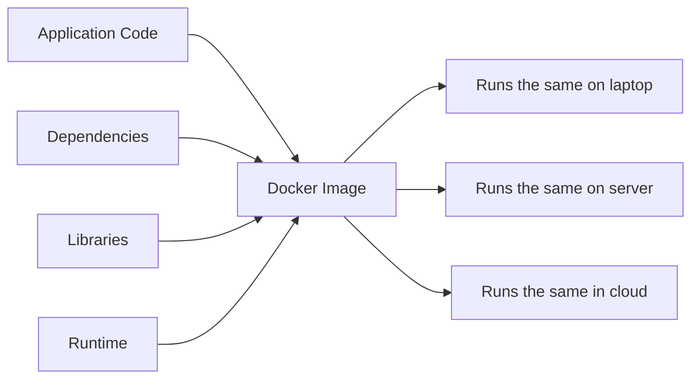
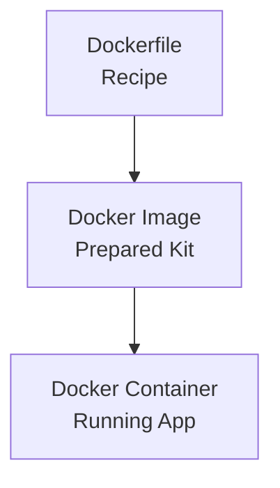
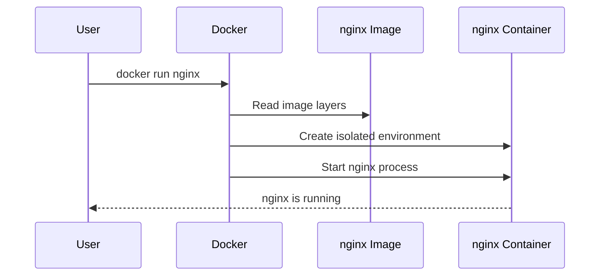
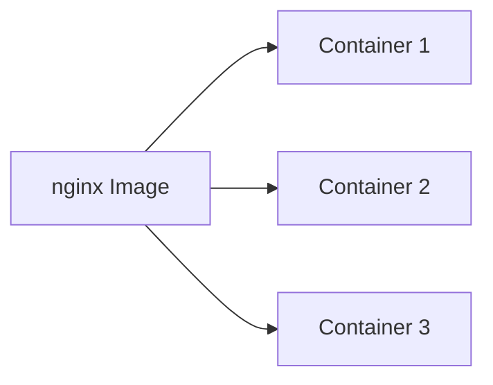
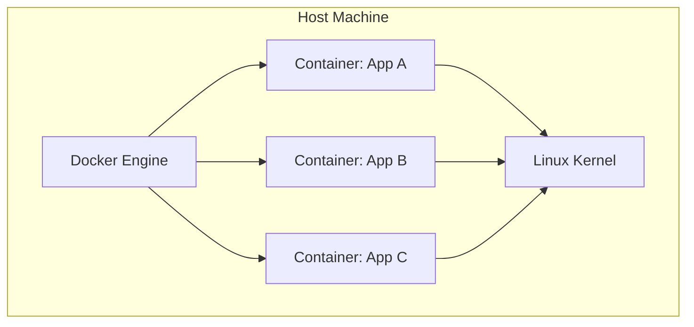
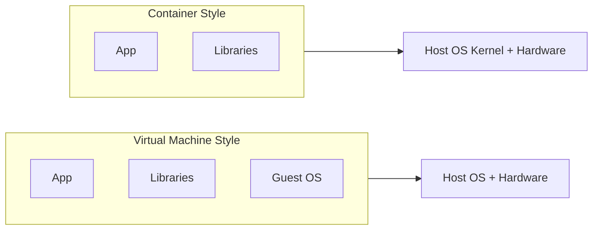

# Chapter 1: Docker

Welcome to the Docker chapter.

Before we jump into Kubernetes, we need to understand the thing Kubernetes loves to run: **containers**. Docker is one of the easiest ways to build, run, and understand containers.

Think of Docker as a lunchbox for your application. The app, its libraries, runtime, files, and dependencies are packed together so it can run almost anywhere without drama.

---

## The Classic Developer Problem

Every developer has either said this sentence or heard it:

> "But it works on my machine!"

That usually happens because the developer's laptop and the production server are not exactly the same.

| Developer Laptop | Production Server |
| --- | --- |
| Java 21 installed | Java 17 installed |
| Correct Python package exists | Package missing |
| Required OS library exists | Library missing |
| Environment variable is set | Environment variable missing |

The code may be correct, but the environment is different. So the application breaks.

Docker helps solve this by packaging the application and its environment together.



---

## What Is Docker?

Docker is a tool that lets you package an application into a **Docker image** and run that image as a **container**.

Simple version:

```text
Docker Image + docker run = Docker Container
```

A Docker image is a ready-made package.
A Docker container is the running application created from that package.

---

## Real-Life Analogy: Butter Chicken

Imagine you want to prepare butter chicken.

| Docker Concept | Cooking Example | Meaning |
| --- | --- | --- |
| Dockerfile | Your written recipe | Instructions to create the image |
| Docker Image | Prepared cooking kit | Blueprint/package with everything needed |
| Docker Container | The cooked dish | The actual running application |

The recipe is not the food.
The cooking kit is still not the food.
The food appears only when you actually cook it.

Similarly:

- A **Dockerfile** tells Docker how to build an image.
- A **Docker image** is the blueprint/package.
- A **Docker container** is created when the image runs.



---

## What Does a Docker Image Contain?

A Docker image can contain:

- application code
- libraries
- dependencies
- runtime
- filesystem structure
- default command to start the app

For example:

```bash
docker pull nginx
```

This downloads the `nginx` image.

Important: downloading an image does **not** mean the application is running. It is like buying the cooking kit and keeping it on the kitchen counter. Nothing is cooked yet.

---

## What Is a Docker Container?

A container is a **running instance of an image**.

For example:

```bash
docker run nginx
```

Now Docker does the real work:

- creates an isolated environment
- starts the `nginx` process
- attaches networking
- provides a filesystem
- keeps the container running while the main process runs



---

## Image vs Container

This is one of the most important Docker ideas.

| Question | Docker Image | Docker Container |
| --- | --- | --- |
| What is it? | Blueprint/package | Running instance |
| Is it active? | No | Yes |
| Can it be shared? | Yes | Usually no |
| Example command | `docker pull nginx` | `docker run nginx` |
| Analogy | Recipe/cooking kit | Cooked dish |

You can create many containers from the same image.



One image. Many running containers. Very useful.

---

## Why Are Containers Lightweight?

Containers do **not** start a full operating system.

Instead, containers share the host machine's Linux kernel and run isolated processes on top of it.



This is why containers usually start quickly and use fewer resources than virtual machines.

---

## Containers vs Virtual Machines

Virtual machines and containers both help isolate applications, but they work differently.

| Feature | Virtual Machine | Docker Container |
| --- | --- | --- |
| Operating system | Each VM has its own OS | Shares host OS kernel |
| Startup time | Usually minutes | Usually seconds |
| Size | Often GBs | Often MBs |
| Resource usage | Heavy | Lightweight |
| Best for | Full OS isolation | Fast app packaging and scaling |



Short version:

```text
VM = app + dependencies + full operating system
Container = app + dependencies, sharing the host kernel
```

---

## Useful Docker Commands

| Command | What it does |
| --- | --- |
| `docker pull nginx` | Downloads the `nginx` image |
| `docker images` | Lists downloaded images |
| `docker run nginx` | Starts a container from the `nginx` image |
| `docker ps` | Lists running containers |
| `docker ps -a` | Lists all containers, including stopped ones |
| `docker stop <container_id>` | Stops a running container |
| `docker rm <container_id>` | Removes a stopped container |
| `docker rmi <image_id>` | Removes an image |

---

## Quick Mental Model

Whenever Docker feels confusing, come back to this:

```text
Dockerfile -> Image -> Container
Instructions -> Package -> Running App
Recipe -> Cooking Kit -> Cooked Dish
```

Docker makes applications portable.
Kubernetes then takes those containers and helps run them at scale.

That is why Docker is a great first stop before learning Kubernetes.
