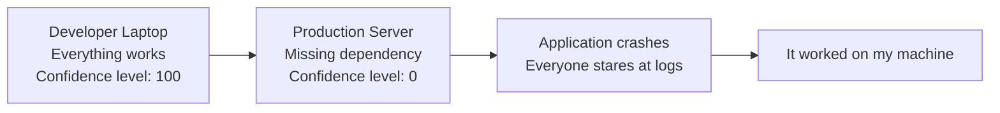
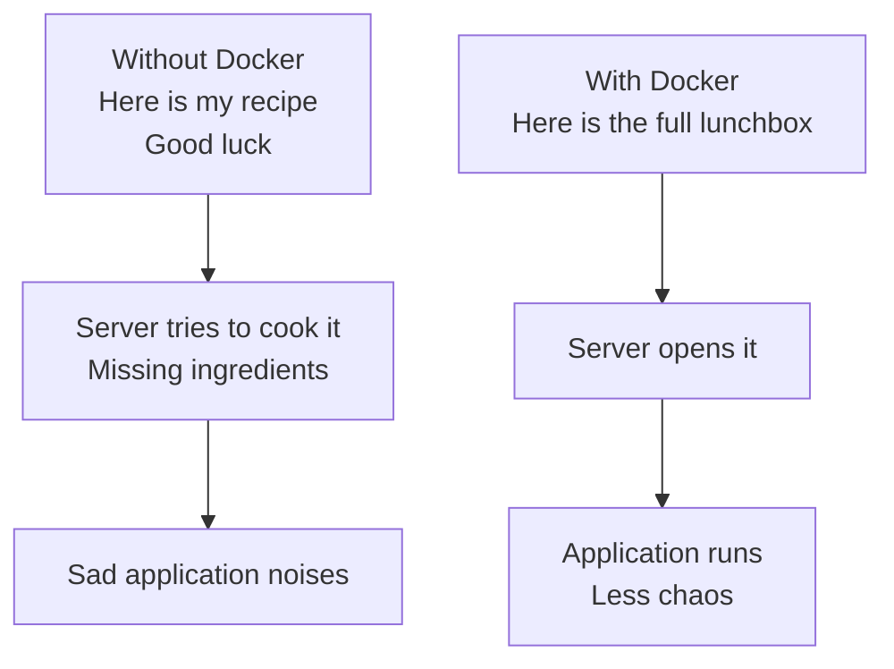
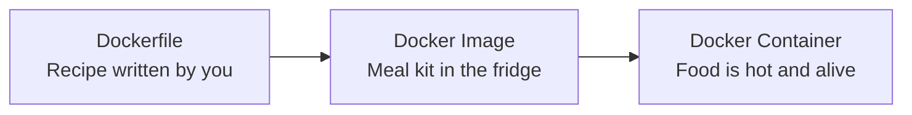
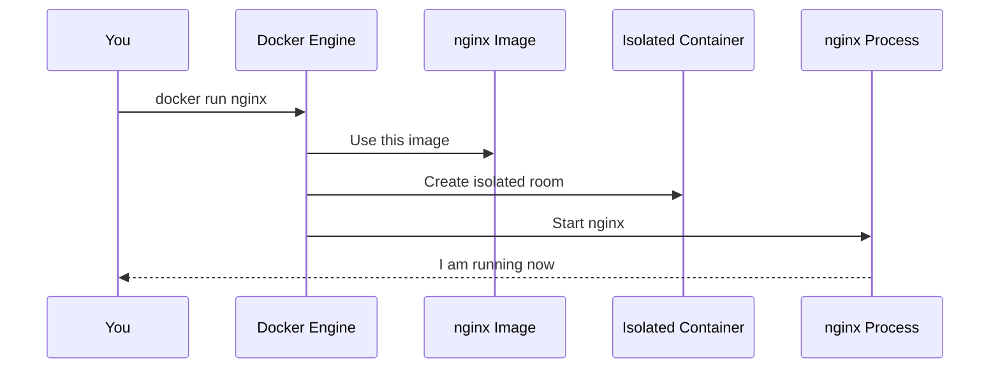
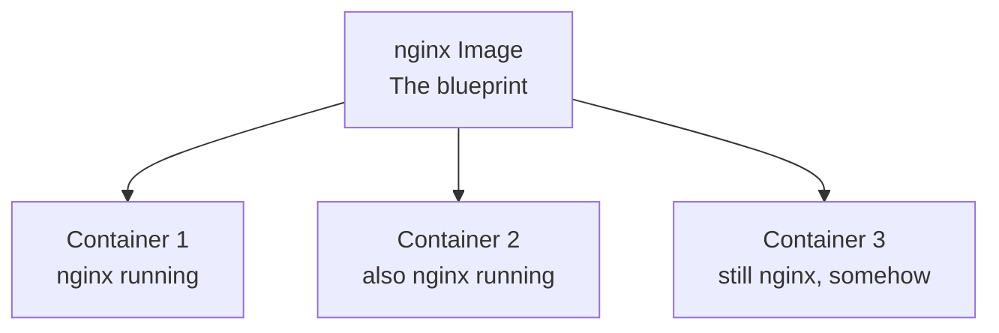
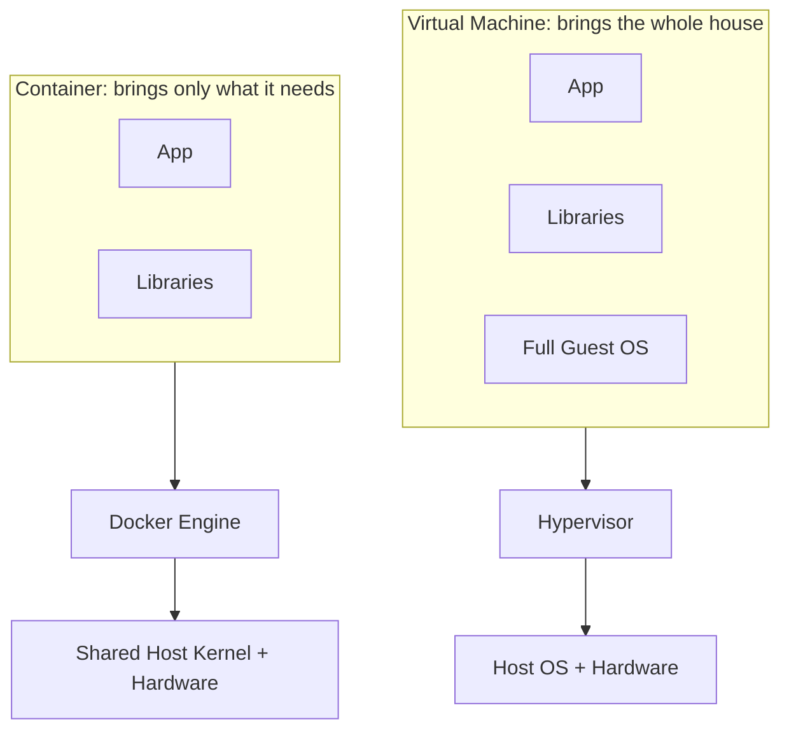

# Chapter 1: Docker

Before Kubernetes enters the room wearing sunglasses and managing 500 containers like a boss, we need to understand the thing it actually manages:

**Containers.**

And Docker is one of the best ways to learn containers without immediately questioning your career choices.

---

## The Villain: "It Works on My Machine"

Every software project has this legendary monster:

> "But it works on my machine."

Translation:

> "My laptop is a magical snowflake and production is being rude."

The app works on the developer laptop, then goes to the server and suddenly forgets how to exist.

Why?

| Developer Laptop | Production Server |
| --- | --- |
| Java version is perfect | Java version is from another timeline |
| Python packages installed | Half the packages are missing |
| Environment variables exist | Environment variables went on vacation |
| OS libraries are available | Server says: "Never heard of them" |

So the application breaks.

Not because the code is always bad.
Sometimes the environment is the real villain.



Docker's job is to reduce this drama.

---

## Docker, Explained Without Corporate Fog

Docker packages your application with the stuff it needs to run:

- code
- dependencies
- libraries
- runtime
- filesystem
- startup command

Then Docker runs that package in an isolated environment called a **container**.

Simple version:

```text
Docker Image + docker run = Docker Container
```

Even simpler:

```text
Package it once. Run it anywhere. Blame fewer things.
```

---

## The Lunchbox Analogy

Imagine your application is lunch.

Without Docker, you send someone a recipe and say:

> "Just make it exactly like I did."

Dangerous. Very dangerous.

They may have different ingredients, a different kitchen, a broken stove, and somehow no salt. Congratulations, lunch is now a production outage.

With Docker, you send the full lunchbox:

- the food
- the spoon
- the napkin
- the tiny sauce packet nobody asked for but everyone needs

That is Docker energy.



---

## Image vs Container: The Main Plot

This part is important. If Docker were a movie, this would be the scene where the mentor finally explains the rules.

| Concept | Meaning | Food Example |
| --- | --- | --- |
| Dockerfile | Instructions to build an image | Recipe |
| Docker Image | Packaged application blueprint | Ready-to-cook meal kit |
| Docker Container | Running application | Actual cooked food |

The image is not running.
The container is running.

Read that again because Docker beginners get attacked by this confusion daily.



So when you run:

```bash
docker pull nginx
```

You downloaded the `nginx` image.

That does **not** mean nginx is running.

It means nginx is sitting there like an unopened packet of instant noodles.

To actually run it:

```bash
docker run nginx
```

Now Docker creates a container and starts nginx.

---

## What Happens When You Run a Container?

When you type:

```bash
docker run nginx
```

Docker does a bunch of work behind the curtain:

- finds the `nginx` image
- creates an isolated environment
- adds a filesystem
- connects networking
- starts the nginx process

Basically:

> "Here is a tiny private room. Run your app in there. Do not touch the furniture outside."



---

## One Image, Many Containers

One Docker image can create many containers.

Like one cake recipe can create many cakes.
Some cakes may be beautiful.
Some may be suspicious.
But the recipe is the same.



This is powerful because you can scale applications by creating more containers from the same image.

This idea becomes very important in Kubernetes.

Kubernetes basically says:

> "Give me your containers. I will run them, restart them, scale them, and pretend this is all calm."

---

## Why Containers Are Fast

Containers are lightweight because they do **not** boot a full operating system.

They share the host machine's kernel and run as isolated processes.

That is why containers usually start in seconds.

Virtual machines are more like:

> "Please wait while I bring my entire house, furniture, plumbing, electricity, and operating system."

Containers are more like:

> "I brought my backpack. Let's go."



---

## Containers vs Virtual Machines

| Feature | Virtual Machine | Docker Container |
| --- | --- | --- |
| Has its own OS? | Yes | No, shares host kernel |
| Startup speed | Slow-ish | Fast |
| Size | Usually GBs | Usually MBs |
| Resource usage | Heavy | Light |
| Mood | Moving into a new apartment | Carrying a backpack |

Short version:

```text
VM = app + dependencies + full operating system
Container = app + dependencies + shared host kernel
```

VMs are not bad.
Containers are not magic.

They solve different problems. But for packaging and running applications quickly, containers are usually the cooler kid at the table.

---

## Important Docker Commands

| Command | What it does | Human translation |
| --- | --- | --- |
| `docker pull nginx` | Downloads nginx image | Get the meal kit |
| `docker images` | Lists images | Show me my meal kits |
| `docker run nginx` | Runs nginx container | Cook the thing |
| `docker ps` | Lists running containers | Who is alive right now? |
| `docker ps -a` | Lists all containers | Show alive and retired containers |
| `docker stop <container_id>` | Stops a container | Calm down, app |
| `docker rm <container_id>` | Removes a stopped container | Clean the kitchen |
| `docker rmi <image_id>` | Removes an image | Throw away the meal kit |

---

## The Docker Mental Model

If your brain starts buffering, remember this:

```text
Dockerfile  ->  Image  ->  Container
Recipe      ->  Meal Kit -> Cooked Food
Instructions -> Package -> Running App
```

And this:

```text
docker pull = download the image
docker run  = create and start a container from the image
```

---

## Why Are We Learning This Before Kubernetes?

Because Kubernetes does not run your source code directly.

Kubernetes runs containers.

So if Docker is where we learn to package and run one container, Kubernetes is where we learn to manage many containers without losing our mind.


That is the bridge:

```text
Docker teaches containers.
Kubernetes manages containers.
```

Once this clicks, Kubernetes becomes much less scary.

Still scary, obviously.
But in a professional way.
